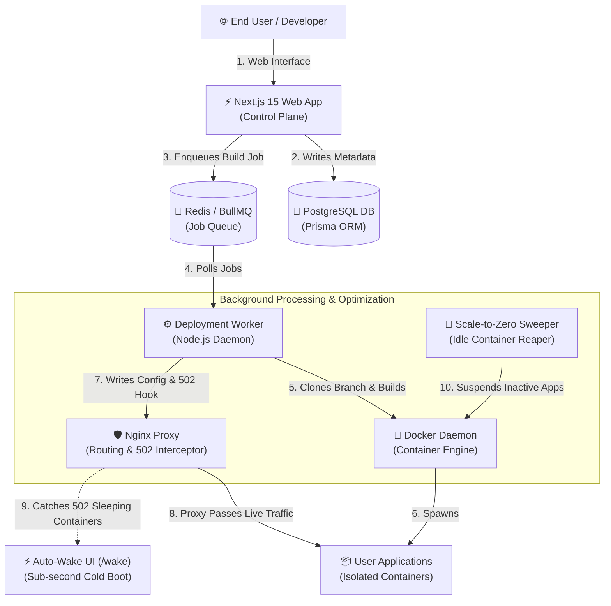

# Rovel: System Architecture & Technical Defense Guide

This document provides a detailed breakdown of the technologies used in Rovel, the reasoning behind each server command, and a structured guide to help you present and explain this project to your professor.

---

## 🛠️ Part 1: The Technology Stack (What & Why)

Rovel is built using a decoupled, multi-tier architecture. Here is an explanation of each technology and why it was selected.



### 1. Frontend Control Plane: Next.js 15 & React
* **What it is**: Next.js is a React framework that supports server-side rendering, static site generation, and backend API routes.
* **Why it was used**: It allows us to build a single codebase that serves both the client dashboard and the backend API routes. Next.js 15 optimizes performance by rendering dashboard data on the server first, reducing page load times for the developer.

### 2. Background Task Queue: Redis & BullMQ
* **What it is**: Redis is an in-memory data structure store used as a database and message broker. BullMQ is a Node.js library that sits on top of Redis to handle fast, reliable job queues.
* **Why it was used**: Compiling code and building Docker images takes time. If a developer clicks "Deploy" and the web server builds the image directly, the request will timeout, and the dashboard will freeze. By using BullMQ, we write the deployment request to a Redis queue. The web console returns a success message immediately, while a background process pulls the job from the queue and handles the heavy work.

### 3. Execution Worker & Scale-to-Zero Daemon: Node.js & TypeScript
* **What it is**: A persistent background service (daemon) running on the server.
* **Why it was used**: It listens for jobs in the Redis queue. When a job arrives, the worker clones the Git repository (including target branches), auto-detects the framework, writes a Dockerfile, builds the Docker image, runs the container, and updates Nginx config files.
* **Scale-to-Zero Background Sweeper**: The daemon runs an automatic reaper cycle every 60 seconds. It checks for containers exceeding their inactivity threshold (default: 15 minutes) and executes `docker stop` to free up host RAM, allowing hundreds of developer apps to share a small VPS.

### 4. Database: PostgreSQL & Prisma ORM
* **What it is**: PostgreSQL is an open-source relational database. Prisma is an Object-Relational Mapper (ORM) that lets us interact with the database using TypeScript code instead of writing raw SQL.
* **Why it was used**: Rovel needs to track users, projects, environment variables, branches, container power states, and deployment history. A relational database ensures data integrity (e.g., deleting a project automatically deletes its associated deployments). Prisma automatically compiles our TypeScript database queries into optimized SQL.

### 5. Application Isolation: Docker
* **What it is**: A containerization platform that packages code and dependencies into isolated environments.
* **Why it was used**: It allows Rovel to host completely different applications (e.g., a Python app and a Next.js app) on the same server without conflicts. Docker ensures that an application cannot access the database or file system of another application. It also lets us set strict limits on CPU (`0.5`) and memory consumption (`512MB`).

### 6. Reverse Proxy & Auto-Wake Interceptor: Nginx
* **What it is**: A high-performance web server and reverse proxy.
* **Why it was used**: Next.js runs on port 3000, and deployed developer apps run on isolated internal ports (e.g., 3001, 3002). Nginx listens on public web ports (80 and 443) and routes traffic based on domain headers (e.g., `neo-clock.apps.rovel.dev` to `127.0.0.1:3001`).
* **502 Error Interception**: When a container is sleeping due to Scale-to-Zero, Nginx intercepts the `502 Bad Gateway` error using `error_page 502 503 504 = @waking_page;` and seamlessly proxies the visitor to the internal Rovel Wake UI (`/wake`), initiating an automatic container boot without showing error screens.

### 7. Process Manager: PM2
* **What it is**: A production process manager for Node.js applications.
* **Why it was used**: If a Node.js script encounters an unhandled error, it crashes and exits. PM2 keeps our Next.js dashboard and deployment worker running persistently in the background. If a service crashes, PM2 automatically restarts it. It also restarts services automatically if the server reboots.

### 8. Automation: GitHub Actions CI/CD
* **What it is**: A CI/CD automation tool built into GitHub.
* **Why it was used**: It eliminates manual deployment. Every time you push code to your `main` branch, GitHub Actions logs into your AWS EC2 instance via SSH and runs the update script.

---

## ⚡ Part 2: Advanced Platform Features

### 1. Scale-to-Zero & Cold-Start Lifecycle
* **Automatic Hibernation**: The worker sweeper compares `now - project.lastActiveAt >= idleTimeoutMinutes * 60 * 1000`. When idle, `docker stop` executes and `containerStatus` switches to `SLEEPING`, freeing 100% of the container's RAM.
* **Seamless Wake Gateway**: When a user or web visitor navigates to a sleeping app URL:
  1. Nginx detects the closed port and intercepts the 502 status.
  2. Nginx routes the request to Next.js `/wake?app=<slug>`.
  3. The browser displays a dark-mode animated loading screen showing boot progress.
  4. The wake page fires `POST /api/wake`, which executes `docker start rovel-<slug>` in < 1.5 seconds.
  5. As soon as the container responds `200 OK`, the page triggers `window.location.reload()`, seamlessly loading the live app.

### 2. Multi-Environment & Branch Deployments
* **Git Branch Support**: Users can choose to deploy specific branches (e.g., `main`, `staging`, `feature-auth`) from the dashboard or via GitHub push webhooks.
* **Automatic Environment Tagging**:
  * Pushes to the project's default branch (e.g., `main`) are automatically tagged as **🟢 Live Production**.
  * Pushes to secondary or feature branches are tagged as **🔵 Preview** builds.
* **1-Click Rollback & Instant Promotion**:
  * Any historical `READY` deployment can be promoted to Production with a single click.
  * The promotion API checks if the local Docker image (`rovel-${projectId}:${deploymentId}`) is still present in cache. If available, it instantly replaces the running container without waiting for a re-build.

---

## ⌨️ Part 3: Key Server Commands Explained (What & Why)

### 1. Swap File Creation
```bash
sudo fallocate -l 4G /swapfile
sudo chmod 600 /swapfile
sudo mkswap /swapfile
sudo swapon /swapfile
```
* **What it does**: Allocates 4 GB of SSD space and tells the operating system to use it as virtual memory.
* **Why we ran it**: The EC2 instance has only 2 GB of physical RAM. Running Node.js, PostgreSQL, Redis, and a Docker build process simultaneously can exceed 2 GB. Without a swap file, the operating system's Out-Of-Memory (OOM) killer would terminate your database or freeze the server.

### 2. Nginx Directory Ownership
```bash
sudo chown -R ubuntu:ubuntu /etc/nginx/sites-enabled/
```
* **What it does**: Transfers ownership of the Nginx configuration directory from the system `root` user to the `ubuntu` user.
* **Why we ran it**: The worker daemon runs under the `ubuntu` user account. To deploy a new app, the worker must write a proxy configuration file (e.g., `neo-clock.conf`) into `/etc/nginx/sites-enabled/`. By default, this directory is owned by `root`, which results in a `Permission Denied` error when the worker tries to write the configuration.

### 3. Let's Encrypt Directory Permissions
```bash
sudo chmod -R 755 /etc/letsencrypt/
```
* **What it does**: Grants read and execute permissions on the Let's Encrypt directories to all users.
* **Why we ran it**: Let's Encrypt stores SSL certificates under `/etc/letsencrypt/live/` with `0700` permissions (readable only by `root`). The worker daemon runs as `ubuntu` and needs to verify if a wildcard certificate exists to configure HTTPS. Without this command, the worker cannot traverse the directories, causing it to fall back to insecure HTTP.

### 4. Database Sync with Prisma
```bash
node -e "require('dotenv').config(); ..."
```
* **What it does**: Loads environment variables from `.env.production` and runs the Prisma schema push command.
* **Why we ran it**: Prisma requires the `DATABASE_URL` variable to connect to PostgreSQL. Simply running `npm run db:push` in the terminal does not automatically load variables from `.env.production`. Using a Node wrapper ensures that the environment variables are loaded into memory before the database sync runs.

### 5. PM2 Restart with Environment Update
```bash
pm2 restart all --update-env
```
* **What it does**: Restarts all background processes and forces them to reload the environment variables from disk.
* **Why we ran it**: PM2 caches environment variables in memory when a process is first started. If you modify `.env.production`, a simple restart will not load the changes. The `--update-env` flag forces PM2 to overwrite its memory cache with the new file values.

---

## 🎓 Part 4: Presentation Guide for Your Professor

When demonstrating this project to your professor, focus on the software engineering principles and system design patterns you implemented.

### 1. Key Talking Points
* **Decoupled Event-Driven Architecture**: Explain that the control plane (Next.js) and the build execution layer (Worker) are decoupled, communicating asynchronously via BullMQ and Redis queues.
* **Resource Optimization with Scale-to-Zero**: Highlight the automated 60-second reaper that suspends idle containers and the Nginx 502 reverse proxy hook that enables sub-second cold starts without error screens.
* **Process Isolation & Multi-Tenancy**: Highlight that user applications are deployed in isolated Docker containers with strict memory limits (`512MB`) and CPU quotas (`0.5`).
* **Multi-Environment Branch Deployments & Rollbacks**: Show how GitHub pushes deploy to Preview vs Production, and demonstrate instant 1-click promotion and rollbacks.
* **Infrastructure Automation**: Demonstrate the CI/CD pipeline. Push a change to GitHub and show how GitHub Actions automatically updates the platform with zero downtime.

### 2. Potential Questions & How to Answer Them

* **Q: Why did you choose to build a custom worker instead of using a standard CI/CD tool?**
  * *A*: Standard CI/CD tools build code but do not handle dynamic routing, subdomain allocation, wildcard SSL generation, or Scale-to-Zero container power management for external developers. Rovel acts as a complete PaaS, managing the entire application lifecycle from code push to active URL generation.
* **Q: How does Rovel handle Scale-to-Zero without breaking incoming user traffic?**
  * *A*: When a container is sleeping, its local port is closed. Instead of letting Nginx return a 502 Bad Gateway to the user, we configure Nginx with `error_page 502 503 504 = @waking_page;` to proxy the request to our Next.js `/wake` gateway. The gateway triggers a fast `docker start` in the background and automatically reloads the browser once the app is responsive.
* **Q: How does Rovel handle database security?**
  * *A*: All database containers (PostgreSQL and Redis) are bound specifically to `127.0.0.1` (localhost). They are not exposed to the public internet. Only the Nginx proxy listens on public ports (80/443) and forwards requests internally.
* **Q: What is the benefit of the monorepo structure you used?**
  * *A*: It allows us to organize the frontend (`apps/web`), the background worker (`apps/worker`), and the database schemas (`packages/db`) in a single repository. This ensures that a database schema change is immediately visible and typesafe across both the frontend and the worker.
